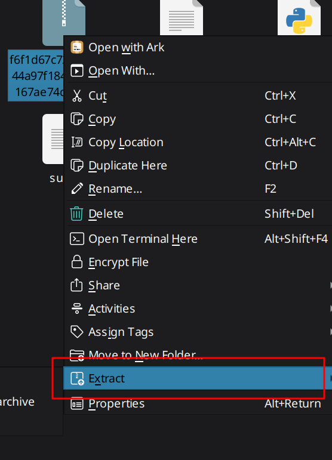

# chatgpt-analyzer
Analyze your ChatGPT stats 

## How to get the sweet data?
### 1. Go to https://chatgpt.com

### 2. Go to your account settings

### 3. Go to "Data Controls" and press "Export data"

### 4. Go download your data package
This might take a bit. For me personally, it only took about a minute for my package to arrive

### 5. Extract the zip file
Please extract it **into a folder**

### 6. Run the program and drag-and-drop your folder into the terminal

